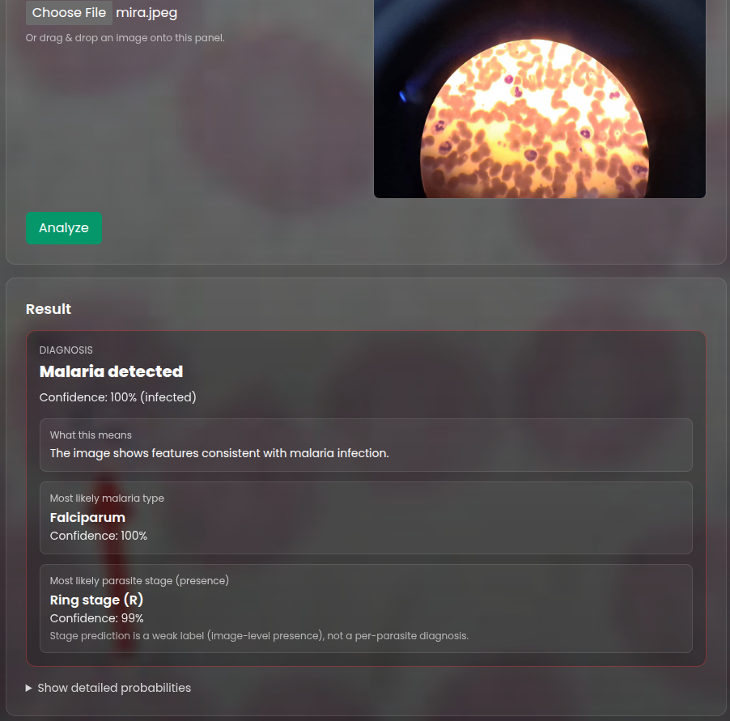

# Malaria Detection CNN (Rust + Burn)

[](https://www.rust-lang.org/)
[](https://opensource.org/licenses/MIT)
[](https://github.com/username/malaria-detection-cnn/actions)
[](https://github.com/username/malaria-detection-cnn)
[](https://webassembly.org/)
[](https://github.com/username/malaria-detection-cnn)

> **AI system for malaria detection from blood smear images**  
> Implemented in Rust (Burn) with an Axum inference API and a Yew web UI.


## Overview

This model predicts:

- **Infected vs Uninfected** (gating)
- **Species**: Falciparum, Malariae, Ovale, Vivax (plus an internal Uninfected class)
- **Stage presence** (multi-label): Ring (R), Trophozoite (T), Schizont (S), Gametocyte (G)

Stage labels are weak (image-level presence inferred from filename tokens) and are treated as presence probabilities.

## Repository Layout

- `src/bin/mpidb_prep.rs`: crop generation + `manifest.csv` writer
- `src/training.rs`: training entry point
- `src/bin/server.rs`: inference API (Axum)
- `inference-ui/`: web UI (Yew)
- `DEV_GUIDE.md`: detailed crop/manifest strategy

## Requirements

- Rust toolchain
- UI: `trunk` + target `wasm32-unknown-unknown`

## Data Preparation (Crops + Manifest)

This project trains from a CSV manifest generated by `mpidb_prep`.

Expected input folders:

1) **MP-IDB species dataset** (infected) (one folder per species):

```text
data/
├── Falciparum/
│   ├── img/...
│   └── gt/...
├── Malariae/
│   ├── img/...
│   └── gt/...
├── Ovale/
│   ├── img/...
│   └── gt/...
└── Vivax/
    ├── img/...
    └── gt/...
```

2) **Uninfected negatives**:

```text
data/
└── Uninfected/
    ├── cell_1.png
    ├── cell_2.png
    └── ...
```

Generate crops + `manifest.csv`:

```bash
cargo run --bin mpidb_prep -- data mpidb_crops 128 25
```

Outputs:

- `mpidb_crops/<Species>/*.png` (infected crops)
- `mpidb_crops/Uninfected/*.png` (uninfected crops)
- `mpidb_crops/manifest.csv`

Manifest schema:

```text
crop_path,infected,species,stage_r,stage_t,stage_s,stage_g,source_image_id
```

For a detailed explanation of the cropping strategy and leakage-safe splitting, see:

- `DEV_GUIDE.md`

## Training

```bash
cargo run --release
```

Training reads the manifest path configured in `src/config.rs`:

- `mpidb_crops/manifest.csv`

## Inference API (Rust)

Start the server:

```bash
MODEL_PATH=./malaria-model.bin cargo run --bin server
```

Endpoints:

- `GET /health` → `ok`
- `POST /predict` → `multipart/form-data` with field `image` (or `file`)

Example request:

```bash
curl -X POST http://localhost:8080/predict -F "image=@./some_image.png"
```

Example response:

```json
{
  "infected": true,
  "predicted_species": "Falciparum",
  "species_probabilities": [0.87, 0.05, 0.03, 0.02, 0.03],
  "stage_probabilities": [0.92, 0.15, 0.08, 0.02]
}
```

## Inference UI (Yew)

```bash
rustup target add wasm32-unknown-unknown
cargo install trunk

cd inference-ui
trunk serve --open
```

## License

MIT. See `LICENSE`.
